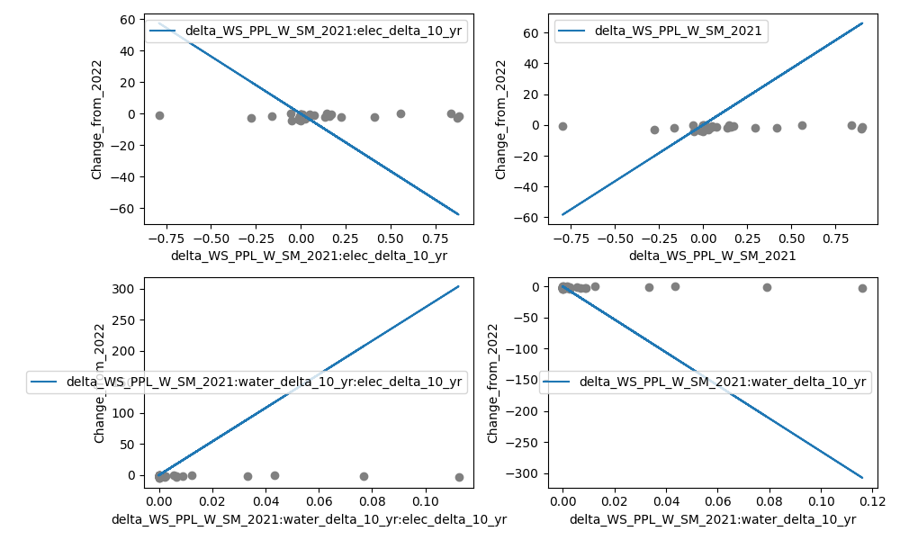

# README

#### Contents

1. [Overview](#overview)
2. [Local Development](#local-development)

---

## Overview

In this project, I present three poor models that were selected using exhaustive search. They do not hold up under any amount of inspection.



## Local Development

I used Python 3.12, but you could probably use an older version.
Here's a starter script for Linux.

```sh
# Create a virtual environment
python3 -m venv ./venv

# Activate the virtual environment
source ./venv/bin/activate

# Install the requirements
pip install -r requirements.txt
```

Now you can run the notebook and code in `src/`.

---

# Appendix

## Raw Data

Raw data is from Kaggle.
This info is also in [`data-raw/MANIFEST.json`](./data-raw/MANIFEST.json).

* [Electricity](https://www.kaggle.com/datasets/sazidthe1/global-electricity-production)
* [Water](https://www.kaggle.com/datasets/kanchana1990/un-global-water-data-2012-2022)
* [Economic Freedom](https://www.kaggle.com/datasets/mlippo/freedom-economic-index)
* [Economic Freedom XLSX](https://www.kaggle.com/code/sagarraturi/pandas-and-data-visualization/input)
	- This one has a change from 2022 score, so we can use it to predict freedom from electricity and water trends.
